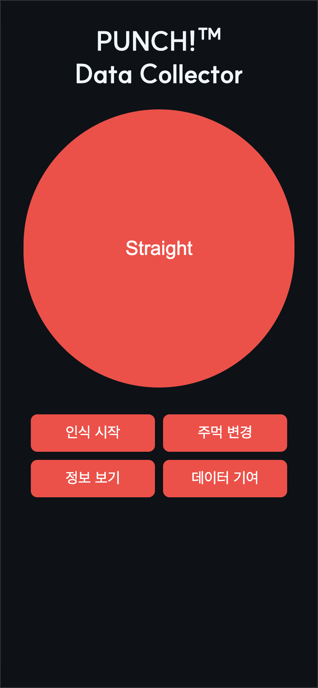

# PUNCH!™ Data Collector (web ver.)

> ⚠️ 서비스를 사용하기 전 이 문서를 읽으시오

> ⚠️ READ THIS DOCUMENT BEFORE USING

# 사용법

## 0. 간편 사용법

- 인식 시작 버튼을 누른다
- 주먹을 내질러 돌아오기 바로 직전에 주먹 인식 버튼을 누른다
- 모두 인식한 후 인식 정지 버튼을 누른다
- 데이터 기여 버튼을 누른다

## 1. 주먹 버튼 ( 이미지상 Straight )

위 버튼은 사용자가 주먹을 뻗은 후, 주먹이 고점(뻗은 주먹이 다시 돌아오기 직전)에 이르렀을 때 눌러야합니다. 위 버튼을 제대로된 시간에 누르는 것이 매우 중요하며, 만약 본인이 테스트를 하던 중 타이밍이 안 맞는 부분(약 0.5초 이상의 간격)이 발생하였을 경우 페이지를 다시 로딩하여 이전 데이터를 초기화하고 새로 인식해주시길 바랍니다.

## 2. 인식 시작

웹 사이트를 통해 휴대폰의 가속도 센서와 자이로 센서 값, 그 값들을 바탕으로 계산한 위상, 사용자의 주먹 인식 여부 등 모든 데이터를 축적하기 시작합니다. 이 서비스를 처음 사용할 경우 기기의 센서들을 사용할 권한을 요구할 것입니다. 수락하지 않거나 오류가 발생한다면 새로고침하여 재시도 해주십시오.

## 3. 주먹 변경

사용자가 데이터를 축적할 때 무조건 설정된 주먹만 내질러야합니다. 다른 주먹을 인식할 경우 제작자에게 불이익이 됩니다. 주먹이 변경 되는 순서는 아래와 같습니다.

Straight -> Hook -> Uppercut -> Body -> Straight -> Hook ...

위 주먹에 대해 모두 잘 아신다면 각각의 주먹들을 인식해주십시오. 만약 복싱에 대해 잘 모른다면 일반적으로 앞으로 내지르는 주먹인 기본 값(Straight)을 인식해주시길 바랍니다.

## 4. 정보 보기

휴대폰 센서 데이터와 각종 현재 정보에 대한 창이 주먹 인식 버튼 대신 나타납니다.

## 5. 데이터 기여

> ⚠️ 모든 인식이 완료되었다면 인식 정지 버튼을 누른 후 이 버튼을 꼭 눌러주십시오

사용자의 주먹 데이터를 개발자의 백엔드에 저장하는 버튼입니다. 만약 모든 주먹이 정교하게 수행되었다고 판단하고, 인식 과정이 오류이 마무리되었다고 생각하는 경우 이 버튼을 꼭 눌러주시길 바랍니다.
